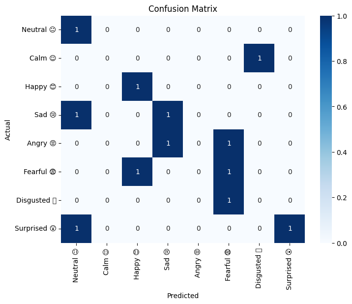
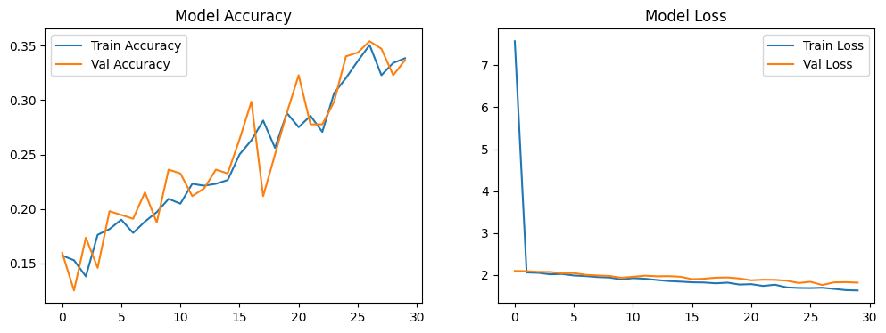

<div align="center">

#  AI-Based Voice Emotion Detection

### Deep Learning • Audio Analysis • Emotion Classification

<p>
A deep learning-based application that detects human emotions from voice input by analyzing audio features and classifying them into distinct emotional categories.
</p>

<br/>

<a href="YOUR_LIVE_LINK_HERE" target="_blank">
  
</a>

<br/><br/>


</div>

---

## Overview

**AI-Based Voice Emotion Detection** is a deep learning project that analyzes audio signals to identify human emotions such as happiness, sadness, anger, fear, and more.

The system extracts features from voice recordings and uses a trained model to classify emotions, making it useful for applications in human-computer interaction, mental health analysis, and voice-based systems.

---

## Screenshots & Model Analysis

<div align="center">

| Confusion Matrix | 
|------------------|
|  |
| Accuracy & Loss Graph |
|  |

</div>

---

## Explanation of Visualizations

### 1. Confusion Matrix

The confusion matrix shows how well the model classifies different emotions.

- Rows represent **actual emotions**  
- Columns represent **predicted emotions**  
- Diagonal values indicate **correct predictions**  
- Off-diagonal values indicate **misclassifications**  

From the matrix:
- Some emotions like **Happy** and **Neutral** are predicted correctly  
- Certain emotions (like Fearful, Angry) may overlap, showing model confusion  
- Helps evaluate model performance in detail beyond accuracy  

---

### 2. Model Accuracy Graph

This graph shows how accuracy improves over training epochs.

- Training accuracy steadily increases  
- Validation accuracy follows a similar trend  
- Indicates the model is learning patterns from data  

A close alignment between training and validation accuracy suggests **no severe overfitting**.

---

### 3. Model Loss Graph

This graph shows how error decreases over time.

- Training loss decreases rapidly  
- Validation loss also decreases gradually  
- Stabilization indicates the model is converging  

Lower loss means better prediction performance.

---

## Key Features

- Emotion detection from voice/audio input  
- Deep learning-based classification  
- Feature extraction using audio processing  
- Model training and evaluation  
- Visualization of performance metrics  
- Multi-class emotion classification  

---

## Technology Stack

<div align="center">

| Category | Technology |
|----------|-----------|
| Language |  Python |
| Deep Learning |  TensorFlow / Keras |
| Audio Processing |  Librosa |
| Numerical |  NumPy |
| Visualization |  Matplotlib |

</div>

---

## Project Structure

```
09_voice_emotion_detection/
├── dataset/
│   └── audio_files/
├── model/
│   └── trained_model.h5
├── notebooks/
│   └── training.ipynb
├── utils/
│   └── feature_extraction.py
├── requirements.txt
└── assets/
    ├── confusion_matrix.png
    └── training_metrics.png
```

---

## How It Works

1. Audio input is collected  
2. Features are extracted (e.g., MFCCs using Librosa)  
3. Data is passed into deep learning model  
4. Model predicts emotion category  
5. Output is classified into predefined labels  

---

## Model Details

- Multi-class classification model  
- Trained on labeled emotional audio dataset  
- Learns patterns in frequency, tone, and pitch  

---

## Getting Started

### Prerequisites

- Python 3.8+  
- Jupyter Notebook  

---

### Installation

```bash
git clone https://github.com/priyanildz/Voice-Emotion-Detection.git
cd Voice-Emotion-Detection
```

```bash
python -m venv venv
```

```bash
# Windows
venv\Scripts\activate

# macOS/Linux
source venv/bin/activate
```

```bash
pip install -r requirements.txt
```

---

## Run Project

```bash
jupyter notebook
```

Run the training or prediction notebook.

---

## Use Cases

- Emotion-aware virtual assistants  
- Call center sentiment analysis  
- Mental health monitoring  
- Human-computer interaction systems  

---

## Future Improvements

- Real-time voice input detection  
- Web or mobile interface  
- Improved model accuracy with larger dataset  
- Deployment using Flask or Streamlit  

---

## License

This project is licensed under the MIT License.

---

<div align="center">

Developed by  
<strong>priyanildz</strong>

</div>